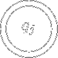
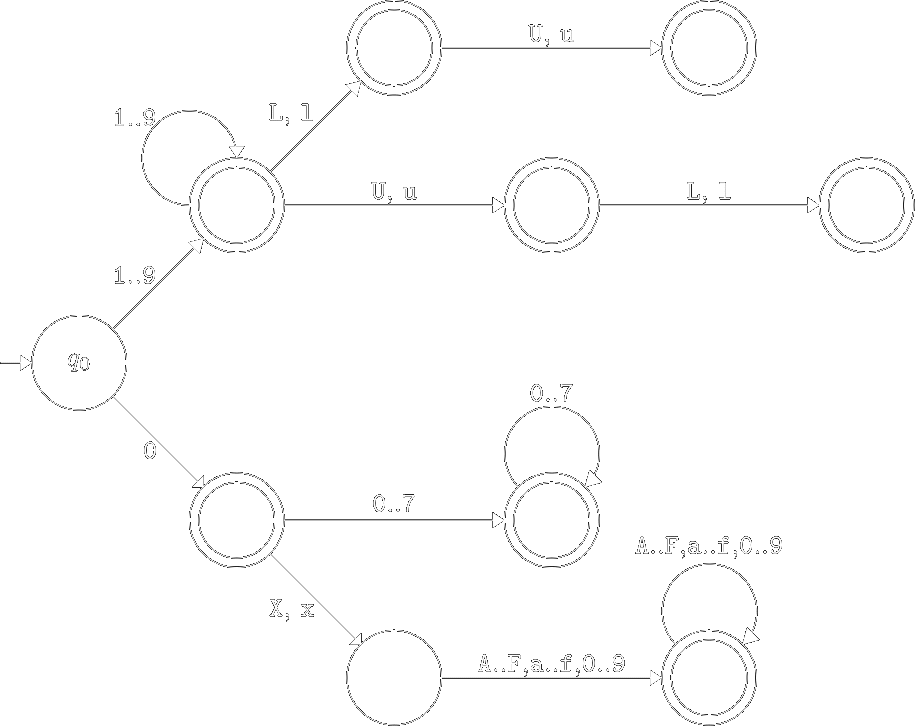
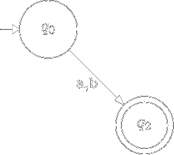
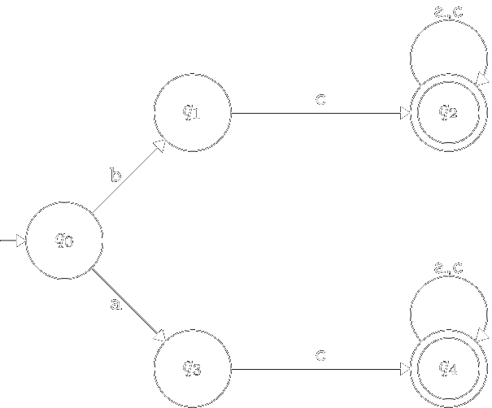



Зміст:
- [Мови програмування та мовні процесори](#мови-програмування-та-мовні-процесори)
	- [Мови програмування](#мови-програмування)
		- [Прагматичний аспект](#прагматичний-аспект)
		- [Семантичний аспект](#семантичний-аспект)
		- [Синтаксичний аспект](#синтаксичний-аспект)
	- [Мовні процесори](#мовні-процесори)
		- [Структура транслятора](#структура-транслятора)
		- [Призначення основних компонентів транслятора](#призначення-основних-компонентів-транслятора)
- [Лексичний аналіз та скінченні автомати](#лексичний-аналіз-та-скінченні-автомати)
	- [Лексичний аналіз в мовних процесорах](#лексичний-аналіз-в-мовних-процесорах)
	- [Скінчені автомати](#скінчені-автомати)
		- [Мова яку розпізнає скінченний автомат](#мова-яку-розпізнає-скінченний-автомат)
		- [Способи визначення функції переходів](#способи-визначення-функції-переходів)
		- [Детерміновані скінченні автомати](#детерміновані-скінченні-автомати)
- [Мінімізація детермінованих скінченних автоматів](#мінімізація-детермінованих-скінченних-автоматів)
	- [Мінімізація детермінованих скінченних автоматів](#мінімізація-детермінованих-скінченних-автоматів-1)
		- [Недосяжні стани](#недосяжні-стани)
		- [Тупикові стани](#тупикові-стани)
		- [Еквівалентні стани](#еквівалентні-стани)
		- [Алгоритм](#алгоритм)
- [Скінченно-автоматні мови і праволінійні граматики](#скінченно-автоматні-мови-і-праволінійні-граматики)
	- [Скінченно-автоматні мови](#скінченно-автоматні-мови)
		- [Базові скінченно-автоматні мови](#базові-мови)
		- [Операції над мовами](#операції-над-мовами)
	- [Скінченні автомати та праволінійні граматики](#скінченні-автомати-та-праволінійні-граматики)
		- [Класифікація граматик Хомського](#класифікація-граматик-Хомського)
		- [Мова породжена граматикою](#мова-породжена-граматикою)
		- [Праволінійна граматика $$\sim$$ скінченний автомат](#праволінійна-граматика--скінченний-автомат)
- [Регулярні множини і регулярні вирази](#регулярні-множини-і-регулярні-вирази)
	- [Регулярні множини](#регулярні-множини)
	- [Регулярні вирази](#регулярні-вирази)
		- [Алгебра регулярних виразів](#алгебра-регулярних-виразів)
		- [Лінійні рівняння](#лінійні-рівняння)
		- [Системи рівнянь](#системи-рівнянь)

# Мови програмування та мовні процесори

## Мови програмування

При вивченні мов програмування, як правило, виділяють три аспекти:
- Прагматичний;
- Семантичний;
- Синтаксичний.

### Прагматичний аспект

_Прагматичний аспект_ (прагматика мови програмування) визначає клас задач, на
розв'язування яких орієнтується мова програмування. Як правило, прагматичний аспект
менш формалізований у порівнянні з семантичним та синтаксичним аспектами.

За класом задач на розв'язування яких орієнтуються мови програмування 
їх можна поділити передусім на 
- процедурні;
- непроцедурні.

_Процедурні_ мови програмування орієнтовані перш за все на опис
(визначення) алгоритмів, тобто по суті використовуються для побудови процедур
обробки даних. До таких мов ми відносимо всім відомі мови програмування, такі
як Pascal, Fortran, C та ін.

_Непроцедурні_ мови програмування на відміну від процедурних неявно
визначають процедури обробки даних. Частіше всього такі мови
використовуються для побудови завдань на обробку даних. При цьому, за
допомогою інструкцій непроцедурної мови програмування визначається що
необхідно зробити з даними і явно не визначається як (з використанням яких
алгоритмів) необхідно розв'язати задачу. До непроцедурних мов програмування
ми відносимо командні мови операційних систем, мови управління в пакетах
прикладних програм та ін.

Як процедурні, так і непроцедурні мови програмування можуть
орієнтуватися як на декілька класів задач, так і конкретну предметну область. У
першому випадку ми будемо говорити про _універсальні_ мови програмування
(Pascal, Fortran, C), в другому &mdash; про _спеціалізовані_
мови програмування (Snobol, Lisp).

### Семантичний аспект

_Семантичний аспект_ (семантика мови програмування) визначається
шляхом конкретизації базових функцій обробки даних, набору конструкцій
управління та методами побудови більш "складних" програм на основі "простих".

Наприклад, визначивши як базовий тип даних "рядок" ми повинні
запропонувати "традиційний" набір функцій обробки таких даних: порівняння
рядків, виділення частини рядка, конкатенацію рядків та ін.

Семантика мови програмування має бути визначена формально, бо інакше у
подальшому неможливо буде побудувати відповідний мовний процесор. Станом на
сьогодні існують два основних напрямки визначення семантики мов
програмування: 
- методи денотаційної семантики;
- методи операційної семантики.

Методи _денотаційної семантики_ базуються на відповідних алгебрах, методи
_операційної семантики_ базуються на синтаксичних структурах програм.

### Синтаксичний аспект

_Синтаксичний аспект_ (синтаксис мови програмування) визначає набір
синтаксичних конструкцій мови програмування, які використовуються для нотації
(запису) семантичних одиниць в програмі. Про синтаксис мови програмування
можна сказати як про форму, яка є суть похідною від семантики. Для визначення
(опису) синтаксису мови програмування використовуються як механізми, що
орієнтовані на синтез, так і механізми, орієнтовані на аналіз. 

Задачі аналізу та синтезу синтаксичних структур програм &mdash; це дуальні задачі. 
Їх конкретизацію ми будемо розглядати в наступних розділах.

Виходячи з вищенасказаного, щоб побудувати мову програмування потрібно:
- визначити клас (класи) задач, на розв'язок яких орієнтована мова 
	програмування;
- виділити базові типи даних та функції їх обробки, вказати конструкції
	управління в програмах. Побудувати механізми конструювання більш складних
	програм та структур даних на основі більш простих одиниць;
- визначити синтаксис мови програмування.

## Мовні процесори

_Мовні процесори_ реалізують мови програмування. Точніше, мовний
процесор призначений для обробки програм відповідної мови програмування. З
точки зору прагматики, мовні процесори діляться на
- транслятори;
- інтерпретатори.

_Мовний процесор типу транслятор (транслятор)_ &mdash; це програмний
комплекс, котрий на вході отримує текст програми на вхідній мові, а на виході
видає версію програми на вихідній мові, що називається об'єктною мовою. В
більшості випадків як об'єктна мова виступає мова команд деякої обчислювальної
машини. Серед трансляторів можна виділити дві програмні системи:
- компілятори &mdash; транслятори з мов програмування високого рівня;
- асемблери &mdash; транслятори машинно-орієнтованих мов програмування.

_Мовний процесор типу інтерпретатор (інтерпретатор)_ &mdash; це програмний
комплекс, котрий на вході отримує текст програми на вхідній мові та вхідні дані,
які в подальшому обробляються програмою, а на виході видає результати
обчислень (вихідні дані).

Оскільки транслятори та інтерпретатори реалізують мови програмування,
вони мають спільні риси: їх структура досить схожа, в основу їх реалізації
покладено спільні теоретичні результати та практичні методи реалізації.

### Структура транслятора

1. Вхідний текст програми
2. Лексичний аналіз
3. Синтаксичний аналіз
4. Семантичний аналіз
5. Оптимізація проміжного коду
6. Генерація коду
7. Вихідний (об'єктний) код

### Призначення основних компонентів транслятора

1. _Лексичний аналізатор._
	
	**Вхід:** вхідний текст (послідовність літер) програми.

	**Вихід:** послідовність лексем програми.

	_Лексема_ &mdash; це ланцюжок літер, що має певний зміст. Всі лексеми мови
	програмування (їх кількість, як правило, нескінчена) можна розбити на скінчену
	множину класів. Для більшості мов програмування актуальні наступні класи
	лексем:
	- зарезервовані слова;
	- ідентифікатори;
	- числові константи (цілі та дійсні числа);
	- літерні константи;
	- рядкові константи;
	- коди операцій;
	- коментарі. Безпосередньо не несуть інформації щодо структури
		програми. В подальшому не використовуються, тобто не передаються
		синтаксичному аналізатору.
	- дужки та інші елементи програми.
2. _Синтаксичний аналізатор._

	**Вхід:** послідовність лексем програми.
	
	**Вихід:**
	
	- "Так" + синтаксична структура (синтаксичний терм) програми,
	- "Ні" + синтаксичні помилки в програмі.
3. _Семантичний аналізатор._

	**Вхід:** Синтаксичний терм програми.

	**Вихід:**
	- "Так" + семантична структура (семантичний терм) програми,
	- "Ні" + семантичні помилки в програмі.
4. _Оптимізація проміжного коду._

	**Вхід:** семантичний терм програми.

	**Вихід:** оптимізований семантичний терм програми.

	_Оптимізація_ &mdash; це еквівалентне перетворення програми на основі певних
	критеріїв. Серед критеріїв оптимізації можна виділити:
	- оптимізацію по пам'яті;
	- оптимізацію по швидкості виконання. 
	
	В залежності від підходів по оптимізації програми можна розглядати такі
	методи оптимізації:
	- машинно-залежні;
	- машинно-незалежні

	На відміну від машинно-незалежних
	методів машинно-залежні методи оптимізації враховують архітектурні особливості
	ЕОМ, наприклад, наявність апаратного стека, наявність вільних регістрів, тощо.
5. _Генерація об'єктного коду._

	**Вхід:** семантичний терм програми.

	**Вихід:** результуючий (об'єктний) код програми.

# Лексичний аналіз та скінченні автомати

## Лексичний аналіз в мовних процесорах

**Призначення:** перетворення вхідного тексту програми з формату
зовнішнього представлення в машинно-орієнтований формат &mdash; послідовність
лексем.

Нагадаємо, що _лексема_ &mdash; це ланцюжок літер елементарний об'єкт програми, що несе
певний семантичний зміст. В подальшому кожну лексему будемо представляти як
пару
```
(клас_лексеми, ім'я_лексеми)
```

В більшості мов програмування для визначення класів лексем достатньо
скінченних автоматів.

## Скінчені автомати

_Недетермінований скінчений автомат_ &mdash; це п'ятірка

$$
M = \left\langle Q, \Sigma, \delta, q_0, F \right\rangle,
$$

де

- $$Q = \{q_0, q_1, \ldots, q_{n-1}\}$$ &mdash; скінчена множина станів автомата;
- $$\Sigma = \{a_1, a_2, \ldots, a_m\}$$ &mdash; скінчена множина вхідних символів (вхідний алфавіт);
- $$q_0 \in Q$$ &mdash; початковий стан автомата;
- $$\delta$$ &mdash; відображення множини $$Q \times \Sigma$$ в множину $$2^Q$$. 
	Відображення $$\delta$$ як
	правило називають функцією переходів;
- $$F \subset Q$$ &mdash; множина заключних станів. Елементи з $$F$$ називають заключними
	або фінальними станами.

Якщо $$M$$ &mdash; скінчений автомат, то пара 
$$(q, w) \in Q \times \Sigma^\star$$ називається
_конфігурацією автомата_ $$M$$. Оскільки скінчений автомат &mdash; це дискретний
пристрій, він працює по тактам. Такт скінченого автомата $$M$$ задається бінарним
відношенням $$\models$$, яке визначається на конфігураціях:

$$
(q_1, a w) \models (q_2, w) \quad \text{if} \quad q_2 \in \delta(q_1, a), \quad \forall w \in \Sigma^\star.
$$

### Мова яку розпізнає скінченний автомат

Скінчений автомат $$M$$ _розпізнає (допускає)_ ланцюжок $$w$$, якщо

$$
\exists q \in F: \quad (q_0, w) \models^\star (q, \varepsilon),
$$

де $$\models^\star$$ &mdash; рефлексивно-транзитивне замикання бінарного відношення $$\models$$.

_Mова_, яку допускає автомат $$M$$ (розпізнає автомат $$M$$)

$$
L(M) = \left\{ w \middle| w \in \Sigma^\star, (q_0, w) \models^\star (q, \varepsilon), q \in F \right\}.
$$

### Способи визначення функції переходів

На практиці, при визначенні скінченого автомата $$M$$, використовують
декілька способів визначення функції $$\delta$$, наприклад:
- це табличне визначення $$\delta$$;
- діаграма проходів скінченого автомата.

_Табличне визначення_ функції $$\delta$$ &mdash; це таблиця $$M(q_i, a_j)$$, де $$aj \in \Sigma, q_i \in Q$$, тобто

$$
M(q_i, a_j) = \left\{ q_k \middle| q_k \in \delta(q_i, a_j) \right\}.
$$

_Діаграма переходів_ скінченого автомата $$M$$ &mdash; це невпорядкований граф $$G(V,
P)$$, де $$V$$ &mdash; множина вершин графа, а $$P$$ &mdash; множина орієнтованих дуг,
причому з вершини $$q_i$$ у вершину $$q_j$$ веде дуга позначена $$a_k$$, 
коли $$q_j \in \delta(q_i, a_k)$$. На
діаграмі переходів скінченого автомата це позначається так:


В подальшому, на діаграмі переходів скінченого автомата $$M$$ елементи з
множини заключних станів будемо позначити так:



**Приклад.** Побудуємо діаграму переходів скінченого автомата $$M$$, який
розпізнає множину цілочислових констант мови С.



**Зауваження.** Цей автомат неповний, на два нижні праві вузли потрібно 
довісити "UL"-частину яка висить на вузлі "1..9".

З побудованого прикладу видно, що приведений автомат не повністю
визначений.

### Детерміновані скінченні автомати

Скінчений автомат $$M$$ називається _детермінованим_, якщо $$\delta(a_i, a_k)$$
містить не більше одного стану для любого $$q_i \in Q$$ та $$a_k \in \Sigma$$.

**Теорема.** _Для довільного недетермінованого скінченого автомата $$M$$ можна
побудувати еквівалентний йому детермінований скінчений автомат $$M'$$, такий що_

$$
L(M) = L(M').
$$

**Доведення:** Нехай $$M$$ &mdash; недетермінований скінчений автомат, такий що

$$
M = \left\langle Q, \Sigma, \delta, q_0, F \right\rangle.
$$

Детермінований автомат $$M' = \left\langle Q', \Sigma, \delta', q_0', F \right\rangle$$ 
побудуємо таким чином:

1. $$Q' = 2^Q$$, тобто імена станів автомата $$M'$$ &mdash; це підмножини множини $$Q$$.
2. $$q_0' = \{q_0\} \in 2^Q = Q'$$.
3. $$F'$$ складається з усіх таких підмножин $$S \in 2^Q = Q'$$, 
	що $$S \cap F \ne \varnothing$$.
4. $$\delta'(S, a) \models \left\{ q \mid q \in \delta(q_i, a), q_i \in S \right\}$$.

Доводимо індукцією по $$i$$, що $$(S, w) \models^i (S', \varepsilon)$$, тоді і тільки тоді,
коли $$S' = \left\{ q \middle| \exists q_i \in S: (q_i, w) \models^i (q, \varepsilon) \right\}$$.

Зокрема, $$ \left(\{q_0\}, w\right) \models^\star (S', \varepsilon)$$, 
для деякого $$S' \in F'$$, тоді і тільки тоді, коли $$\exists q \in F: (q_0, w) \models^\star (q, \varepsilon)$$.

Таким чином, $$L(M) = L(M')$$.

Побудований нами автомат $$M$$ має дві властивості: він детермінований та
повністю визначений. До того ж кількість станів цього автомата $$2^n - 1$$.

# Мінімізація детермінованих скінченних автоматів

## Мінімізація детермінованих скінченних автоматів

В подальшому при програмуванні скінченних автоматів важливо мати справу
з так званими "мінімальними автоматами". _Мінімальним_ для даного скінченого
автомата називається еквівалентний йому автомат з мінімальною кількістю станів.

Нагадаємо, що два автомати називаються _еквівалентними_ якщо вони розпізнають одну мову.

Те, що скінчені автомати можна мінімізувати покажемо на наступному прикладі:


Навіть при поверхневому аналізі діаграми переходів наведеного скінченого
автомата видно, що вершини $$q_3$$, $$q_4$$ та $$q_5$$ є "зайвими", тобто при їх вилученні
новий автомат буде еквівалентний початковому. З наведеного вище прикладу
видно, що для отриманого детермінованого скінченого автомата можна
запропонувати еквівалентний йому автомат з меншою кількістю станів, тобто
мінімізувати скінчений автомат. Очевидно що серед зайвих станів цього
автомата є недосяжні та тупикові стани.

### Недосяжні стани

Стан $$q$$ скінченого автомата $$M$$ називається _недосяжним_, якщо на
діаграмі переходів скінченого автомата не існує шляху з $$q_0$$ в $$q$$.

**Алгоритм [пошуку недосяжних станів].** Спочатку спробуємо побудувати множину
досяжних станів. Якщо $$Q_m$$ &mdash; множина досяжних станів скінченого автомата $$M$$, то
$$Q \setminus Q_m$$ &mdash; множина недосяжних станів. Побудуємо послідовність множин $$Q_0, Q_1, Q_2, \ldots$$ таким чином, що:

1. $$Q_0 = \{q_0\}$$.
2. $$Q_i = Q_{i-1} \cup \left\{ q \mid \exists a \in \Sigma, q_j \in Q_{i - 1}: q \in \delta(q_j, a) \right\}$$.
3. $$Q_m = Q_{m+1} = \ldots$$.

Справді, очевидно, що кількість кроків скінчена, тому що послідовність $$Q_i$$
монотонна $$\left(Q_0 \subseteq Q_1 \subseteq Q_2 \subseteq \ldots\right)$$ 
та обмежена зверху: $$Q_m \subseteq Q$$.

Тоді $$Q_m$$ &mdash; множина досяжних станів скінченого автомата, 
а $$Q\setminus Q_m$$ &mdash; множина недосяжних станів.

Вилучимо з діаграми переходів скінченого автомата $$M$$ недосяжні вершини:


В новому автоматі функція $$\delta$$ визначається лише для досяжних
станів. Побудований нами скінчений автомат з меншою кількістю станів буде
еквівалентний початковому.

### Тупикові стани

Стан $$q$$ скінченого автомата $$M$$ називається _тупиковим_, якщо на
діаграмі переходів скінченого автомата не існує шляху з $$q$$ в $$F$$.

**Алгоритм [пошуку тупикових станів].** Спочатку спробуємо знайти нетупикові
стани. Якщо $$S_m$$ &mdash; множина нетупикових станів, 
то $$Q \setminus S_m$$ &mdash; множина тупикових
станів. Побудуємо послідовність множин $$S_0, S_1, S_2, \ldots$$ таким чином, що:

1. $$S_0 = F$$.
2. $$S_i = S_{i - 1} \cup \left\{ q \mid \exists a \in \Sigma: \delta(q, a) \cap S_{i - 1} \ne \varnothing \right\}$$.
3. $$S_m = S_{m + 1} = \ldots$$.

Очевидно, що кількість кроків скінчена, тому що послідовність $$S_i$$
монотонна $$\left(S_0 \subseteq S_1 \subseteq S_2 \subseteq \ldots\right)$$ та обмежена зверху &mdash; $$S_m \subseteq Q$$.

Тоді $$S_m$$ &mdash; множина нетупикових станів скінченого автомата, 
а $$Q \setminus S_m$$ &mdash; множина тупикових станів. 

Вилучимо з діаграми переходів скінченого автомата $$M$$ тупикові вершини:



В новому автоматі функція $$\delta$$ визначається лише для нетупикових станів.

### Еквівалентні стани

Автомат, у котрого відсутні недосяжні та тупикові стани, піддається
подальшій мінімізації шляхом "склеювання" еквівалентних станів.
Продемонструємо це на конкретному прикладі:



Очевидно, що для наведеного вище скінченого автомата можна побудувати
еквівалентний йому скінчений автомат з меншою кількістю станів:


Ми досягли бажаного нам результату шляхом "склеювання" двох станів $$q_1 \equiv q_3$$ та $$q_2 \equiv q_4$$.

Два стани $$q_1$$ та $$q_2$$ скінченого автомата $$M$$ називаються _еквівалентними_ 
(позначається $$q_1 \equiv q_2$$),
якщо множини слів, які розпізнає автомат, починаючи з $$q_1$$ та $$q_2$$, співпадають.

Нехай $$q_1$$ та $$q_2$$ &mdash; два різні стани скінченого автомата $$M$$, 
а $$x \in \Sigma^\star$$. Будемо
говорити, що ланцюжок $$x$$ _розрізняє_ стани $$q_1$$ та $$q_2$$, якщо $$(q_1,x) \models^\star (q_3, \varepsilon)$$ та $$(q_2,x) \models^\star (q_4, \varepsilon)$$, 
причому рівно один зі станів $$q_3$$ і $$q_4$$ (не) належить множині заключних станів.

Стани $$q_1$$ та $$q_2$$ називаються _$$k$$-нерозрізнені_, 
якщо не існує ланцюжка $$x$$ ($$\left|x\right| \le k$$),
що розрізняє стани $$q_1$$ та $$q_2$$. 

Два стани $$q_1$$ та $$q_2$$ _нерозрізнені_, якщо вони
$$k$$-нерозрізнені для довільного $$k$$.

**Теорема.** _Два стани $$q_1$$ та $$q_2$$ довільного скінченого автомата $$M$$ з $$n$$
станами нерозрізнені, якщо вони $$(n - 2)$$-нерозрізнені._

**Доведення:** На першому кроці розіб'ємо множину станів скінченого
автомата на дві підмножини: $$F$$ та $$Q \setminus F$$. 
На цій основі побудуємо відношення $$\equiv^0$$:
$$q_1 \equiv^0 q_2$$, якщо обидва стани одночасно належать $$F$$ або $$Q \setminus F$$.

Побудуємо відношення $$\equiv^k$$:
$$q_1 \equiv^k q_2$$, якщо $$q_1 \equiv^{k - 1} q_2$$ та $$\delta(q_1,а) \equiv^{k - 1} \delta(q_2, а)$$ для всіх $$а \in \Sigma$$.

Очевидно, кожна побудована множина містить не більше $$(n-1)$$ елементи.

Таким чином, можна отримати не більше $$(n-2)$$ уточнення відношення $$\equiv^0$$.

Відношення $$\equiv^{n - 2}$$ визначає класи еквівалентних станів автомата $$M$$.

### Алгоритм

**Алгоритм [побудови мінімального скінченого автомата].**

1. Побудувати скінчений автомат без тупикових станів.
2. Побудувати скінчений автомат без недосяжних станів.
3. Знайти множини еквівалентних станів та побудувати найменший
	(мінімальний) автомат.

# Скінченно-автоматні мови і праволінійні граматики

## Скінченно-автоматні мови

Ознайомившись з деякими результатами теорії скінченних автоматів,
спробуємо з'ясувати, які мови (множини слів) є скінчено-автоматними.

### Базові мови

**Твердження:** Скінчено автоматними є наступні множини:
1. порожня словарна множина &mdash; $$\varnothing$$;
2. словарна множина, що складається з одного $$\varepsilon$$-слова &mdash; $$\{\varepsilon\}$$;
3. множина $$\{a\}$$, $$a \in \Sigma$$.

**Доведення:** в кожному випадку нам доведеться конструктивно побудувати
відповідний скінчений автомат:
1. Довільний скінчений автомат з пустою множиною заключних станів (а
	мінімальний &mdash; з пустою множиною станів) допускає $$\varnothing$$;
2. Розглянемо автомат $$M = \left\langle \{q_0\}, \Sigma, q_0, \delta, \{q_0\}\right\rangle$$,
	у якому $$\delta$$ не визначено ні для яких $$a \in \Sigma$$. Тоді $$L(M) = \{\varepsilon\}$$.
3. Розглянемо автомат 
	$$M = \left\langle \{q_0, q_1\}, \Sigma, q_0, \delta, \{q_1\}\right\rangle$$, 
	у якому функція $$\delta$$ визначена лише для пари $$(q_0, a)$$, а саме: 
	$$\delta(q_0, a) = \{q_1\}$$. Тоді $$L(M) = \{a\}$$.

### Операції над мовами

**Твердження:** Якщо $$M_1 = \left\langle Q_1, \Sigma, q_0^1, \delta_1, F_1 \right\rangle$$ 
та $$M_2 = \left\langle Q_2, \Sigma, q_0^2, \delta_2, F_2\right\rangle$$, що
визначають відповідно мови $$L(M_1)$$ та $$L(M_2)$$, то скінченно-автоматними мовами будуть:
1. $$L(M_1) \cup L(M_2) = \left\{w \mid q \in L(M_1) \text{ or } q \in L(M_2)\right\}$$;
2. $$L(M_1) \cdot L(M_2) = \left\{w = xy \mid x \in L(M_1), y \in L(M_2) \right\}$$;
3. $$L(M_1)^\star = \{\varepsilon\} \cup L(M_1) \cup L(M_1)^2 \cup L(M_1)^3 \cup \ldots$$.

**Доведення:** в кожному випадку нам доведеться конструктивно побудувати
відповідний скінчений автомат:
1. Побудуємо автомат $$M = \left\langle Q, \Sigma, q_0, \delta, F \right\rangle$$ такий, що $$L(M) = L(M_1) \cup L(M_2)$$:
	- $$Q = Q_1 \cup Q_2 \cup \{q_0\}$$, де $$q_0$$ &mdash; новий стан 
		$$(q_0 \notin Q_1 \cup Q_2)$$;
	
	- Функцію $$\delta$$ визначимо таким чином:

		$$
		\delta(q, a) = \begin{cases}
			\delta_1(q, a), & q \in Q_1, \\
			\delta_2(q, a), & q \in Q_2, \\
			\delta_1(q_0^1, a) \cup \delta_2(q_0^2, a), & q = q_0. 
		\end{cases}
		$$

	- Множина заключних станів:

		$$
		F = \begin{cases}
		F_1 \cup F_2, & \text{if } \varepsilon \notin L_1 \cup L_2, \\
		F_1 \cup F_2 \cup \{q_0\}, & \text{otherwise}.
		\end{cases}
		$$

	Побудований таким чином автомат взагалі кажучи недетермінований. 

	Індукцією по $$i$$ показуємо, що $$(q_0, w) \models^i (q,\varepsilon)$$ 
	тоді і тільки тоді, коли $$(q_0^1,w) \models^i (q,\varepsilon), q \in F_1$$ 
	або $$(q_0^2,w) \models^i (q,\varepsilon), q \in F_2$$.
2. Побудуємо автомат $$M = \left\langle Q, \Sigma, q_0, \delta, F \right\rangle$$ такий, що $$L(M) = L(M_1) \cdot L(M_2)$$:
	- $$Q = Q_1 \cup Q_2$$;
	- $$q_0 = q_0^1$$;
	- Функцію $$\delta$$ визначимо таким чином:

		$$
		\delta(q, a) = \begin{cases}
		\delta_1(q, a), & q \in Q_1 \setminus F_1, \\
		\delta_2(q, a), & q \in Q_2, \\
		\delta_1(q, a) \cup \delta_2(q_0^2,a), & q \in F_1.
		\end{cases}
		$$

	- Множина заключних станів:

		$$
		F = \begin{cases}
		F_2, & \text{if } \varepsilon \notin L_2, \\
		F_1 \cup F_2, & \text{otherwise}.
		\end{cases}
		$$

3. Побудуємо автомат $$M = \left\langle Q, \Sigma, q_0, \delta, F \right\rangle$$ такий, що $$L(M) = L(M_1)^\star$$:
	- $$Q = Q_1 \cup \{q_0\}$$, де $$q_0$$ &mdash; новий стан $$(q_0 \notin Q_1)$$;
	- Функцію $$\delta$$ визначимо таким чином:

		$$
		\delta (q, a) = \begin{cases}
		\delta_1(q, a), & q \in Q_1 \setminus F_1, \\
		\delta_1(q_0^1, a), & q = q_0, \\
		\delta_1(q, a) \cup \delta_1(q_0^1, a), & q \in F_1.
		\end{cases}
		$$

	- Множина заключних станів $$F = F_1 \cup \{q_0\}$$.

## Скінченні автомати та праволінійні граматики

_Породжуюча граматика_ $$G$$ &mdash; це четвірка

$$
G = \left\langle N, \Sigma, P, S \right\rangle,
$$

де: 
- $$N$$ &mdash; скінченна множина &mdash; допоміжний алфавіт (нетермінали);
- $$\Sigma$$ &mdash; скінченна множина &mdash; основний алфавіт (термінали);
- $$P$$ &mdash; скінченна множина правил вигляду

	$$
	\alpha \mapsto \beta, \quad \alpha \in \left(N \cup \Sigma\right)^\star \times N \times	\left(N \cup \Sigma\right)^\star, \quad \beta \in \left(N \cup \Sigma\right).
	$$

- $$S$$ &mdash; виділений нетермінал (аксіома).

### Класифікація граматик Хомського

В залежності від структури правил граматики діляться на чотири типи:

- Тип 0: граматики загального вигляду, коли правила не мають обмежень, тобто
	
	$$
	\alpha \mapsto \beta, \quad \alpha \in \left(N \cup \Sigma\right)^\star \times N \times	\left(N \cup \Sigma\right)^\star, \quad \beta \in \left(N \cup \Sigma\right).
	$$

- Тип 1: граматики, що не укорочуються, коли обмеження на правила
	мінімальні, а саме:

	$$
	\alpha \mapsto \beta, \quad \alpha \in \left(N \cup \Sigma\right)^\star \times N \times	\left(N \cup \Sigma\right)^\star, \quad \beta \in \left(N \cup \Sigma\right), \quad |\alpha| \le |\beta|.
	$$

- Тип 2: контекстно-вільні граматики, коли правила в схемі $$P$$ мають вигляд:
	
	$$
	A_i \mapsto \beta, \quad A_i \in N, \quad \beta \in \left(N \cup \Sigma\right)^\star.
	$$

- Тип 3: скінченно-автоматні граматики, коли правила в схемі $$P$$ мають вигляд:

	$$
	A_i \mapsto w A_j, \quad A_i \mapsto w, \quad Ai \mapsto A_j w,
	$$

	де $$A_i, A_j \in N$$, $$w \in \Sigma^\star$$.

В класі скінченно-автоматних граматик виділимо так звані _праволінійні
граматики_ &mdash; це граматики, які в схемі Р мають правила вигляду:

$$
A_i \mapsto w A_j, \quad A_i \mapsto w,
$$

де $$A_i, A_j \in N$$, $$w \in \Sigma^\star$$.

Нескладно довести, що клас праволінійних граматик співпадає з класом граматик
типу 3.

### Мова породжена граматикою

Ланцюжок $$w_1$$ _безпосередньо виводиться_ з ланцюжка $$w$$
(позначається $$w \Rightarrow w_1$$), якщо $$w = x \alpha y$$, 
$$w_1 = x \beta y$$ та в схемі $$P$$ граматики $$G$$ є
правило виду $$\alpha \mapsto \beta$$. Оскільки поняття "безпосередньо виводиться""
розглядається на парах ланцюжків, то в подальшому символ $$\Rightarrow$$
буде трактуватися як бінарне відношення.

Ланцюжок $$w_1$$ _виводиться_ з ланцюжка $$w$$ (позначається $$w \Rightarrow^\star w_1$$), якщо
існує скінчена послідовність виду $$w \Rightarrow w_1' \Rightarrow w_2' \Rightarrow \ldots \Rightarrow w_n' \Rightarrow w_1$$. 
Або кажуть, що бінарне відношення $$\Rightarrow^\star$$ &mdash; 
це рефлексивно-транзитивне замикання бінарного відношення $$\Rightarrow$$.

_Мова, яку породжує граматика_ $$G$$ (позначається $$L(G)$$) &mdash; це множина
термінальних ланцюжків: 

$$
L(G) = \left\{ w \mid S \Rightarrow^\star w, w \in \Sigma^\star \right\}.
$$

### Праволінійна граматика $$\sim$$ скінченний автомат

**Теорема.** _Клас мов, що породжуються праволінійними граматиками,
співпадає з класом мов, які розпізнаються скінченими автоматами._

**Доведення.** Спочатку покажемо, що для довільної праволінійної граматики $$G$$
можна побудувати скінчений автомат $$M$$, такий що $$L(M) = L(G)$$.

Розглянемо правила праволінійної граматики. Вони бувають двох типів: $$A_i \mapsto w A_j$$, і $$A_i \mapsto w$$.

На основі правил граматики $$G$$ побудуємо схему $$P_1$$ нової граматики, яка буде
еквівалентною початковій, а саме:
- правила виду $$A_i \mapsto а_1 а_2 \ldots a_p A_j$$ замінимо послідовністю правил
	
	$$
	\begin{aligned}
	A_i &\mapsto a_1 B_1, \\
	B_1 &\mapsto a_2 B_2, \\
	&\ldots \\
	B_{p - 1} &\mapsto a_p A_j.
	\end{aligned}
	$$

- правила виду $$A_i \mapsto а_1 а_2 \ldots a_p$$ замінимо послідовністю правил
	
	$$
	\begin{aligned}
	A_i &\mapsto a_1 B_1, \\
	B_1 &\mapsto a_2 B_2, \\
	&\ldots \\
	B_{p - 1} &\mapsto a_p B_p, \\
	B_p &\mapsto \varepsilon.
	\end{aligned}
	$$

де $$B_1, B_2, \ldots$$ &mdash; це нові нетермінали граматики $$G_1$$. 
Очевидно, що граматика $$G_1$$ буде еквівалентна граматиці $$G$$.

Далі, на основі граматики $$G_1$$ побудуємо скінчений автомат $$M$$, таким чином:
- як імена станів автомата візьмемо нетермінали граматики $$G_1$$;
- початковий стан автомата позначається аксіомою $$S$$;
- функція $$\delta$$ визначається діаграмою переходів, яка будується на основі правил
	вигляду $$A_i \mapsto a_k A_j$$:

	
- множина $$F$$ заключних станів скінченого автомата визначається так: 
	$$F = \{ A_i \mid A_i \mapsto \varepsilon \}$$.

Індукцією по довжині вхідного слова покажемо, що якщо $$S \Rightarrow^{n + 1} w$$, 
то $$(q_0, w) \models^n (q, \varepsilon)$$:
- База: $$i = 0$$: $$S \Rightarrow \varepsilon$$, тоді $$(q_0, \varepsilon) \models^0 (q_0, \varepsilon)$$.
- Перехід: нехай $$|w| = i + 1$$, тобто $$w = a w_1$$.
	Тоді $$S \Rightarrow a A_p \Rightarrow^i a w_1$$ та 
	$$(q_0, a w_1) \models (q_i, w_1) \models^{i - 1} (q, \varepsilon)$$, де $$q \in F$$.

Доведення навпаки є очевидним.

# Регулярні множини і регулярні вирази

## Регулярні множини

Нехай $$\Sigma$$ &mdash; скінчений алфавіт. _Регулярна множина_ в алфавіті $$\Sigma$$
визначається рекурсивно:
1. $$\varnothing$$ &mdash; пуста множина &mdash; це регулярна множина в алфавіті $$\Sigma$$;
2. $$\{\varepsilon\}$$ &mdash; пусте слово &mdash; регулярна множина в алфавіті $$\Sigma$$;
3. $$\{a\}$$ &mdash; однолітерна множина &mdash; регулярна множина в алфавіті $$\Sigma$$;
4. Якщо $$P$$ та $$Q$$ &mdash; регулярні множини, то такими є наступні множини:
	- $$P \cup Q$$ (операція об'єднання);
	- $$P \times Q$$ (операція конкатенації);
	- $$P^\star = \{\varepsilon\} \cup P \cup P^2 \cup ldots$$ (операція ітерації).
5. Ніякі інші множини, окрім побудованих на основі 1&ndash;4 не є регулярними множинами.

Таким чином, регулярні множини можна побудувати з базових елементів
1-3 шляхом скінченого застосування операцій об'єднання, конкатенації та
ітерації.

## Регулярні виразі

Регулярні вирази позначають регулярні множини таким чином, що:
1. $$0$$ позначає регулярну множину $$\varnothing$$;
2. $$\varepsilon$$ позначає регулярну множину $$\{\varepsilon\}$$;
3. $$a$$ позначає регулярну множину $$\{a\}$$;
4. Якщо $$p$$ та $$q$$ позначають відповідно регулярні множини $$P$$ та $$Q$$, то
	- $$p + q$$ позначає регулярну множину $$P \cup Q$$;
	- $$p \cdot q$$ позначає регулярну множину $$P \times Q$$;
	- $$p^\star$$ позначає регулярну множину $$P^\star$$.
5. Ніякі інші вирази, окрім побудованих на основі 1&ndash;4 не є регулярними виразами.

### Алгебра регулярних виразів

Оскільки ми почали вести мову про вирази, нам зручніше перейти до поняття
алгебри регулярних виразів. Для кожної алгебри одним з важливих питань є
питання еквівалентних перетворень, які виконуються на основі тотожностей у цій
алгебрі. Сформулюємо основні тотожності алгебри регулярних виразів:

1. $$a + b = b + a$$ (комутативність додавання);
2. $$a \cdot \varepsilon = \varepsilon \cdot a = a$$ ($$\varepsilon$$ &mdash; нейтральний елемент за множенням);
3. 2. $$a \cdot 0 = 0 \cdot a = 0$$ ($$0$$ &mdash; нульовий елемент за множенням);
4. $$a \cdot (b + c) = a \cdot b + a \cdot c$$ (ліва дистрибутивність множення відносно додавання);
5. $$(a + b) \cdot c = a \cdot c + b \cdot c$$ (права дистрибутивність множення відносно додавання);
7. $$a + b + c = a + (b + c)$$ (ліва асоціативність додавання);
8. $$a + b + c = (a + b) + c$$ (права асоціативність додавання).

У алгебри регулярних виразів є і некласичні властивості:

6. $$a + a = a$$;
9. $$p + p^\star = p^\star$$;
10. $$0^\star = \varepsilon$$;
11. $$\varepsilon^\star = \varepsilon$$.

### Лінійні рівняння

За аналогією з класичними алгебрами розглянемо лінійне рівняння в алгебрі
регулярних виразів: $$X = a \cdot X + b$$, де $$a$$, $$b$$ &mdash; регулярні вирази.

Взагалі кажучи таке рівняння (в залежності від $$a$$ та $$b$$) може мати безліч розв'язків,

Серед всіх розв'язків рівняння з регулярними
коефіцієнтами виберемо найменший розв'язок $$X = a^\star \cdot b$$, який назвемо _найменша
нерухома точка._ 

Щоб перевірити, що $$a^\star \cdot b$$ справді розв'язок рівняння в алгебрі регулярних
виразів, підставимо його в початкове рівняння та перевіримо тотожність виразів
на основі системи тотожних перетворень:

$$
a^\star b = a a^\star b = (a a^\star + \varepsilon) b = (a (\varepsilon + a + a^2 + \ldots ) + \varepsilon) b = (\varepsilon a + a^2 + \ldots) b = a^\star b.
$$

### Системи рівнянь

В алгебрі регулярних виразів також розглядають і системи лінійних рівнянь з
регулярними коефіцієнтами:

$$
\left\{
\begin{aligned}
X_1 &= a_{11} X_1 + a_{12} X_2 + \ldots + a_{1n} X_n + b_1, \\
X_2 &= a_{21} X_1 + a_{22} X_2 + \ldots + a_{2n} X_n + b_2, \\
&\ldots \\
X_n &= a_{n1} X_1 + a_{n2} X_2 + \ldots + a_{nn} X_n + b_n.
\end{aligned}
\right.
$$

Метод розв'язування системи лінійних рівнянь з регулярними коефіцієнтами
нагадує метод виключення Гауса.
1. Для $i = \overline{1..n}$$, використавши систему
	тотожних перетворень, записати  $$i$$-е рівняння у вигляді:
	$$X_i = a X_i + b$$, де $$a$$ &mdash; регулярний вираз в алфавіті $$\Sigma$$, 
	а $$b$$ &mdash; регулярний вираз виду 
	$$\beta_0 + \beta_{i+1} X_{i+1} + \beta_{i+2} X_{i+2} + \ldots \beta_n X_n$$, 
	де $$\beta_k$$ ($$k = 0, \overline{i+1..n}) &mdash; регулярні коефіцієнти. Далі,
	в правих частинах рівнянь зі змінними $$X_{i+1}, X_{i+2}, \ldots X_n$$ в лівій частині рівняння підставити замість $$X_i$$ значення $$a^\star b$$.
2. Для $i = \overline{n..1}$$ розв'язати $$i$$-е рівняння 
	яке зараз має вигляд $$X_i = a X_i + b$$, де $$a$$, $$b$$ &mdash; 
	регулярні вирази в алфавіті $$\Sigma$$, і підставити його розв'язок $$a^\star b$$
	у коефіцієнти рівнянь зі змінними $$X_{i-1}, X_{i-2}, \ldots X_1$$.

**Приклад.** Розв'язати систему $$2\times2$$:
	
$$
\left\{
\begin{aligned}
X_1 &= a_{11} X_1 + a_{12} X_2 + b_1, \\
X_2 &= a_{21} X_1 + a_{22} X_2 + b_2.
\right.
$$

**Розв'язок:**
