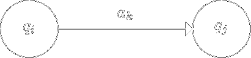
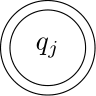



[Назад на головну](../README.md)

Зміст:

- [Лексичний аналіз в мовних процесорах](#лексичний-аналіз-в-мовних-процесорах)
- [Скінчені автомати](#скінчені-автомати)
	-[Мова яку розпізнає скінченний автомат](#мова-яку-розпізнає-скінченний-автомат)
	-[Способи визначення функції переходів](#способи-визначення-функції-переходів)
	-[Детерміновані скінченні автомати](#детерміновані-скінченні-автомати)
- [Контрольні запитання](#контрольні-запитання)

## Лексичний аналіз в мовних процесорах

**Призначення:** перетворення вхідного тексту програми з формату
зовнішнього представлення в машинно-орієнтований формат &mdash; послідовність
лексем.

Нагадаємо, що _лексема_ &mdash; це ланцюжок літер елементарний об'єкт програми, що несе
певний семантичний зміст. В подальшому кожну лексему будемо представляти як
пару
```
(клас_лексеми, ім'я_лексеми)
```

В більшості мов програмування для визначення класів лексем достатньо
скінчених автоматів.

## Скінчені автомати

_Недетермінований скінчений автомат_ &mdash; це п'ятірка

$$
M = \left\langle Q, \Sigma, \delta, q_0, F \right\rangle,
$$

де

- $$Q = \{q_0, q_1, \ldots, q_{n-1}\}$$ &mdash; скінчена множина станів автомата;
- $$\Sigma = \{a_1, a_2, \ldots, a_m\}$$ &mdash; скінчена множина вхідних символів (вхідний алфавіт);
- $$q_0 \in Q$$ &mdash; початковий стан автомата;
- $$\delta$$ &mdash; відображення множини $$Q \times \Sigma$$ в множину $$2^Q$$. 
	Відображення $$\delta$$ як
	правило називають функцією переходів;
- $$F \subset Q$$ &mdash; множина заключних станів. Елементи з $$F$$ називають заключними
	або фінальними станами.

Якщо $$M$$ &mdash; скінчений автомат, то пара 
$$(q, w) \in Q \times \Sigma^\star$$ називається
_конфігурацією автомата_ $$M$$. Оскільки скінчений автомат &mdash; це дискретний
пристрій, він працює по тактам. Такт скінченого автомата $$M$$ задається бінарним
відношенням $$\models$$, яке визначається на конфігураціях:

$$
(q_1, a w) \models (q_2, w) \quad \text{if} \quad q_2 \in \delta(q_1, a), \quad \forall w \in \Sigma^\star.
$$

### Мова яку розпізнає скінченний автомат

Скінчений автомат $$M$$ _розпізнає (допускає)_ ланцюжок $$w$$, якщо

$$
\exists q \in F: \quad (q_0, w) \models^\star (q, \varepsilon),
$$

де $$\models^\star$$ &mdash; рефлексивно-транзитивне замикання бінарного відношення $$\models$$.

_Mова_, яку допускає автомат $$M$$ (розпізнає автомат $$M$$)

$$
L(M) = \left\{ w \middle| w \in \Sigma^\star, (q_0, w) \models^\star (q, \varepsilon), q \in F \right\}.
$$

### Способи визначення функції переходів

На практиці, при визначенні скінченого автомата $$M$$, використовують
декілька способів визначення функції $$\delta$$, наприклад:
- це табличне визначення $$\delta$$;
- діаграма проходів скінченого автомата.

_Табличне визначення_ функції $$\delta$$ &mdash; це таблиця $$M(q_i, a_j)$$, де $$aj \in \Sigma, q_i \in Q$$, тобто

$$
M(q_i, a_j) = \left\{ q_k \middle| q_k \in \delta(q_i, a_j) \right\}.
$$

_Діаграма переходів_ скінченого автомата $$M$$ &mdash; це невпорядкований граф $$G(V,
P)$$, де $$V$$ &mdash; множина вершин графа, а $$P$$ &mdash; множина орієнтованих дуг,
причому з вершини $$q_i$$ у вершину $$q_j$$ веде дуга позначена $$a_k$$, 
коли $$q_j \in \delta(q_i, a_k)$$. На
діаграмі переходів скінченого автомата це позначається так:



В подальшому, на діаграмі переходів скінченого автомата $$M$$ елементи з
множини заключних станів будемо позначити так:



**Приклад.** Побудуємо діаграму переходів скінченого автомата $$M$$, який
розпізнає множину цілочислових констант мови С.


**Зауваження.** Цей автомат неповний, на два нижні праві вузли потрібно 
довісити "UL"-частину яка висить на вузлі "1..9".

З побудованого прикладу видно, що приведений автомат не повністю
визначений.

### Детерміновані скінченні автомати

Скінчений автомат $$M$$ називається _детермінованим_, якщо $$\delta(a_i, a_k)$$
містить не більше одного стану для любого $$q_i \in Q$$ та $$a_k \in \Sigma$$.

**Теорема.** _Для довільного недетермінованого скінченого автомата $$M$$ можна
побудувати еквівалентний йому детермінований скінчений автомат $$M'$$, такий що_

$$
L(M) = L(M').
$$

**Доведення:** Нехай $$M$$ &mdash; недетермінований скінчений автомат, такий що

$$
M = \left\langle Q, \Sigma, \delta, q_0, F \right\rangle.
$$

Детермінований автомат $$M' = \left\langle Q', \Sigma, \delta', q_0', F \right\rangle$$ 
побудуємо таким чином:

1. $$Q' = 2^Q$$, тобто імена станів автомата $$M'$$ &mdash; це підмножини множини $$Q$$.
2. $$q_0' = \{q_0\} \in 2^Q = Q'$$.
3. $$F'$$ складається з усіх таких підмножин $$S \in 2^Q = Q'$$, 
	що $$S \cap F \ne \varnothing$$.
4. $$\delta'(S, a) \models \left\{ q \mid q \in \delta(q_i, a), q_i \in S \right\}$$.

Доведимо індукцією по $$i$$, що $$(S, w) \models^i (S', \varepsilon)$$, тоді і тільки тоді,
коли $$S' = \left\{ q \middle| \exists q_i \in S: (q_i, w) \models^i (q, \varepsilon) \right\}$$.

Зокрема, $$ \left(\{q_0\}, w\right) \models^\star (S', \varepsilon)$$, 
для деякого $$S' \in F'$$, тоді і тільки тоді, коли $$\exists q \in F: (q_0, w) \models^\star (q, \varepsilon)$$.

Таким чином, $$L(M) = L(M')$$.

Побудований нами автомат $$M$$ має дві властивості: він детермінований та
повністю визначений. До того ж кількість станів цього автомата $$2^n - 1$$.

## Контрольні запитання

1. У чому призначення лексичного аналізу?
	<!--перетворення вхідного тексту програми з формату зовнішнього представлення в послідовність лексем.-->
2. Що таке недетермінований скінчений автомат?
	<!--п'ятірка (стани, алфавіт, початковий стан, заключні стани, функція переходів)-->
3. Яку мову розпізнає скінченний автомат?
	<!--всі слова що переводять автомат з початкового стану у заключний-->
4. Які два способи визначення функції переходів ви знаєте?
	<!--табличне і через діаграму переходів-->
5. Спробуйте "зламати" вищенаведений автомат що розпізнає цілочислові константи мови C (зверніть увагу на зауваження).
	<!--ll, LL?-->
6. Що таке детермінований скінчений автомат?
	<!--скінченний автомат з однозначною функцією переходів-->
7. Сформулюйте і доведіть теорему про детермінізацію скінченного автомата.
8. Нехай функцція переходів $$\delta$$ не однозначна, але у той же час набуває не багато
	значень на одному наборі аргументів, наприклад не більше двох, тобто $$|M(q, a)| \le 2$$ 
	для довільних $$q \in Q$$ і $$a \in \Sigma$$. Чи можна тоді написати кращу оцінку зверху
	на кількість станів еквівалентного детермінованого автомату ніж $$2^n - 1$$?

(_традиційні_ відповіді можна переглянути у коментарях у вихідному коді цієї сторінки)

[Назад на головну](../README.md)