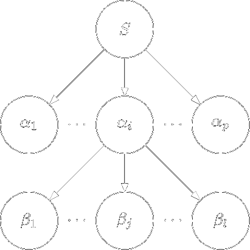
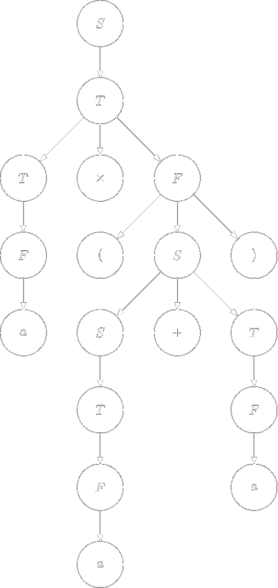



[Назад на головну](../README.md)

Зміст:
- [Синтаксичний аналіз](#синтаксичний-аналіз)
	- [Стратегії виведення](#стратегії-виведення)
	- [Синтаксичні дерева](#синтаксичні-дерева)
	- [Власне аналіз](#власне-аналіз)
	- [Синтез дерева за аналізом](#синтез-дерева-за-аналізом)
	- [Проблеми стратегії "зверху донизу"](#проблеми-стратегії-зверху-донизу)
- [Контрольні запитання](#контрольні-запитання)

## Синтаксичний аналіз

Для визначення синтаксичної компоненти мови програмування
використовують контекстно-вільні граматики (КС-граматики). На відміну від
скінченно-автоматних граматик потужність класу КС-граматик достатня, щоб
визначити майже всі так звані синтаксичні властивості мов програмування.
Якщо цього недостатньо, то розглядають деякі спрощення у граматиках типу 2
або параметричні КC-граматики.

Звичайно, із синтаксичною компонентою мови програмування пов'язана
семантична компонента. Тоді, якщо ми говоримо про семантику мови
програмування, ми вимагаємо семантичної однозначності для кожної вірно
написаної програми. За аналогією з семантикою, при описі синтаксичної
компоненти мови програмування необхідно користуватися однозначними
граматиками.

Граматика $$G$$ називається _неоднозначною_, якщо існує декілька
варіантів виводу $$\omega$$ в $$G$$ $$\left(\omega \in L(G)\right)$$.

**Приклад.** Розглянемо таку граматику $$G = \left\langle N, \Sigma, P, S\right\rangle$$ з двома правилами у схемі $$P$$: $$S \Rightarrow S + S$$, і $$S \Rightarrow a$$. Покажемо, що для ланцюжка $$\omega = a + a + a$$ існує щонайменше два варіанти виводу:
1. $$S \Rightarrow S + S \Rightarrow S + S + S \Rightarrow a + S + S \Rightarrow a + a + S \Rightarrow a + a + a$$.
2. $$S \Rightarrow S + S \Rightarrow a + S \Rightarrow a + S + S \Rightarrow a + a + S \Rightarrow a + a + a$$.

### Стратегії виведення

В теорії граматик розглядається декілька стратегій виведення ланцюжка $$\omega$$ в $$G$$.
Визначимо дві стратегії, які будуть використані в подальшому.

_Лівостороння стратегія виводу_ ланцюжка $$\omega$$ в $$G$$ &mdash; це послідовність кроків
безпосереднього виводу, при якій на кожному кроку до уваги береться перший
зліва направо нетермінал. 

_Правостороння стратегія виводу_ $$\omega$$ в $$G$$ протилежна
лівосторонній стратегії. 

З виводом $$\omega$$ в $$G$$ пов'язане синтаксичне дерево, яке
визначає синтаксичну структуру програми.

### Синтаксичні дерева

_Синтаксичне дерево виведення_ $$\omega$$ в $$G$$ &mdash; це впорядковане дерево,
корінь котрого позначено аксіомою, в проміжних вершинах знаходяться
нетермінали, а на кроні &mdash; елементи з $$\Sigma \cup \{\varepsilon\}$$. Побудова 
синтаксичного дерева виведення $$\omega$$ в $$G$$ виконується покроково з урахуванням стратегії 
виводу $$\omega$$ в $$G$$.

**Алгоритм [побудови синтаксичного дерева ланцюжка $$\omega$$ в граматиці $$G$$ урахуванням лівосторонньої стратегії виводу].**

1. Будуємо корінь дерева та позначимо його аксіомою $$S$$.

2. В схемі $$P$$ граматики $$G$$ візьмемо правило виду 
	$$S \Rightarrow \alpha_1 \alpha_2 \ldots \alpha_p$$, де 
	$$\alpha_i \in N \cup \Sigma \cup \{\varepsilon\} $$
	і побудуємо дерево висоти 1: 

	

3. На кроні дерева, побудованого на попередньому кроці, візьмемо перший зліва
	направо нетермінал. Нехай це буде $$\alpha_i$$. Тоді в схемі $$P$$ виберемо правило виду
	$$\alpha_i \Rightarrow \beta_1 \beta_2 \ldots \beta_l$$, де 
	$$\beta_i \in N \cup \Sigma \cup \{\varepsilon\}$$
	і побудуємо наступне дерево: 

	

	Цей крок виконується доки на кроні дерева є елементи з $$N$$.

Зауважимо очевидні факти, що випливають з побудови синтаксичного дерева:
- крона дерева, зображеного на попередньому малюнку наступна: 
	$$\alpha_1 \alpha_2 \ldots \alpha_{i - 1} \beta_1 \beta_2 \ldots \beta_l \alpha_{i + 1} \ldots \alpha_p$$;
- ланцюжок $$\alpha_1 \alpha_2 \ldots \alpha_{i - 1} \in \Sigma^\star$$ з крони &mdash;
	термінальний ланцюжок;
- для однозначної граматики $$G$$ існує лише одне синтаксичне дерево виводу $$\omega$$ в
	$$G$$.

### Власне аналіз

Будемо говорити, що ланцюжок $$\omega \in \Sigma^\star$$, побудований на основі
граматики $$G$$ $$\left(\omega \in L(G)\right)$$ _проаналізований_, 
якщо відоме одне з його дерев виводу.

Зафіксуємо послідовність номерів правил, які були використані під час побудови
синтаксичного дерева виводу $$\omega$$ в $$G$$ з урахуванням стратегії виводу.

_Лівостороннім аналізом_ $$\pi$$ ланцюжка $$\omega \in L(G)$$ будемо називати
послідовність номерів правил, які були використані при лівосторонньому виводі
$$\omega$$ в $$G$$.

**Приклад:** Для граматики $$G = \left\langle N, \Sigma, P, S\right\rangle$$ зі схемою $$P$$:

$$
\begin{align}
S &\Rightarrow S + T \\
S &\Rightarrow T \\
T &\Rightarrow T \times F \\
T &\Rightarrow F \\
F &\Rightarrow (S) \\
F &\Rightarrow a \\
\end{align}
$$

і для ланцюжка $$\omega = a \times (a + a)$$ побудуємо лівосторонній аналіз $$\pi$$:

Виведення має вигляд:

$$
\begin{multline*}
S \Rightarrow T \Rightarrow T \times F \Rightarrow F \times F \Rightarrow a \times F \Rightarrow a \times (S) \Rightarrow a \times (S + T) \Rightarrow \\
\Rightarrow a \times (T + T) \Rightarrow a \times (F + T) \Rightarrow a \times (a + T) \Rightarrow a \times (a + F) \Rightarrow a \times (a + a).
\end{multline*}
$$

З наведеного вище виводу ланцюжка $$\omega \in L(G)$$ лівосторонній аналіз $$\pi$$ буде:
$$\pi = (2, 3, 4, 6, 5, 1, 2, 4, 6, 4, 6)$$, а синтаксичне дерево виводу $$\omega = a \times (a + a)$$ наступне:

### Синтез дерева за аналізом

Нехай $$\pi$$ &mdash; лівосторонній аналіз ланцюжка $$\omega \in L(G)$$. Знаючи $$\pi$$ досить легко
побудувати (відтворити) синтаксичне дерево. Відтворення (синтез) синтаксичного
дерева можна виконати, скориставшись однією з стратегій синтаксичного аналізу:
- стратегія "зверху донизу";
- стратегія "знизу догори".

Стратегія синтаксичного аналізу _"зверху донизу"_ &mdash; це побудова синтаксичного
дерева крок за кроком починаючи від кореня до крони.

**Алгоритм [синтезу синтаксичного дерева на основі лівостороннього аналізу
$$\pi$$ ланцюжка $$\omega \in L(G)$$].**

1. Побудуємо корінь дерева та позначимо його аксіомою $$S$$. Тоді, якщо
	$$\pi = (p_1, p_2, \ldots, p_m)$$, то
2. Побудуємо дерево висоти один, взявши зі схеми $$P$$ правило з номером $$p_1$$ виду
	$$S \Rightarrow \alpha_1 \alpha_2 \ldots \alpha_p$$:

	
3. На кроні дерева, отриманого на попередньому кроку, візьмемо перший зліва
	направо нетермінал (нехай це буде нетермінал $$\alpha_i$$) та правило з номером $$p_j$$ вигляду: $$\alpha_i \Rightarrow \beta_1 \beta_2 \ldots \beta_l$$ та побудуємо нове дерево:

	

	Даний пункт виконувати доти, доки не переглянемо всі елементи з $$\pi$$.

### Проблеми стратегії "зверху донизу"

Сформулюємо декілька проблему для стратегії аналізу "зверху донизу":

У загальному випадку у класі КС-граматик існує проблема неоднозначності
(недетермінізму) виводу $$\omega \in L(G)$$. Як приклад можемо розглянути граматику з
"циклами". Це така граматика, у якої в схемі $$P$$ існує така послідовність правил
за участю нетермінала $$A_i$$, що: $$A_i \Rightarrow A_j$$ і $$A_j \Rightarrow A_i$$, де $$A_j$$ &mdash; будь-який нетермінал граматики $$G$$. 

Як наслідок, граматики з ліворекурсивним нетерміналом
для стратегії аналізу "зверху донизу" недопустимі. <!--це ж чому?-->

Зауважимо, що існують підкласи класу КС-граматик, які природно забезпечують стратегію
аналізу "зверху донизу". Один з таких підкласів &mdash; це $$LL(k)$$-граматики, які
забезпечують синтаксичний аналіз ланцюжка $$\omega \in L(G)$$ за час $$O(n)$$, 
де $$n = \mid \omega \mid$$, та при цьому аналіз є однозначним.

## Контрольні запитання

1. Які граматики називаються однозначними?
	<!--не неоднозначні, тобто ті в яких у довільного ланцюжка не більше одного виведення-->
2. Які дві стратегії виведення ви знаєте?
	<!--право- і ліво-стороння-->
3. Що таке синтаксичне дерево виведення?
	<!--кроінь аксіома, з вершини стрілки у вершини що отримуються з неї безпосереднім виведенням...-->
4. Що таке лівосторонній аналіз ланцюжка? 
	<!--послідовність номерів правил схеми граматики викристаних при виведенні-->
5. Що таке синтез дерева за аналізом?
	<!--процес побудоваи синтаксичного дерева виведення ланцюжка за синтаксичним аналізом цього ланцюжка-->
6. Які дві стратегії синтезу дерева за аналізом ви знаєте?
	<!--зверху донизу і знизу догори-->
7. Що таке граматика з циклами і які проблеми вона створює для стратегії "згори донизу"?
	<!--граматика у схемі якої є правила $$A_i \Rightarrow A_j \Rightarrow A_i$$, вона призводить до неоднозначності виведення-->
8. Який підклас КС-граматик забезпечує стратегію аналізу "зверху донизу"?
	<!--LL(k), ми скоро визначимо цей підклас-->

(_традиційні_ відповіді можна переглянути у коментарях у вихідному коді цієї сторінки)

[Назад на головну](../README.md)