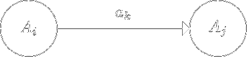



Зміст:

- [Скінченно-автоматні мови](#скінченно-автоматні-мови)

	- [Базові скінченно-автоматні мови](#базові-мови)

	- [Операції над мовами](#операції-над-мовами)

- [Скінченні автомати та праволінійні граматики](#скінченні-автомати-та-праволінійні-граматики)

	- [Класифікація граматик Хомського](#класифікація-граматик-Хомського)

	- [Мова породжена граматикою](#мова-породжена-граматикою)

	- [Праволінійна граматика $$\sim$$ скінченний автомат](#праволінійна-граматика--скінченний-автомат)

- [Контрольні запитання](#контрольні-запитання)

## Скінченно-автоматні мови

Ознайомившись з деякими результатами теорії скінчених автоматів, спробуємо з'ясувати, які мови (множини слів) є скінчено-автоматними.

### Базові мови

**Твердження:** Скінчено автоматними є наступні множини:

1. порожня словарна множина &mdash; $$\varnothing$$;

2. словарна множина, що складається з одного $$\varepsilon$$-слова &mdash; $$\{\varepsilon\}$$;

3. множина $$\{a\}$$, $$a \in \Sigma$$.

**Доведення:** в кожному випадку нам доведеться конструктивно побудувати відповідний скінчений автомат:

1. Довільний скінчений автомат з пустою множиною заключних станів (а мінімальний &mdash; з пустою множиною станів) допускає $$\varnothing$$;

2. Розглянемо автомат $$M = \left\langle \{q_0\}, \Sigma, q_0, \delta, \{q_0\}\right\rangle$$, у якому $$\delta$$ не визначено ні для яких $$a \in \Sigma$$. Тоді $$L(M) = \{\varepsilon\}$$.

3. Розглянемо автомат $$M = \left\langle \{q_0, q_1\}, \Sigma, q_0, \delta, \{q_1\}\right\rangle$$, у якому функція $$\delta$$ визначена лише для пари $$(q_0, a)$$, а саме: $$\delta(q_0, a) = \{q_1\}$$. Тоді $$L(M) = \{a\}$$.

### Операції над мовами

**Твердження:** Якщо $$M_1 = \left\langle Q_1, \Sigma, q_0^1, \delta_1, F_1 \right\rangle$$ та $$M_2 = \left\langle Q_2, \Sigma, q_0^2, \delta_2, F_2\right\rangle$$, що визначають відповідно мови $$L(M_1)$$ та $$L(M_2)$$, то скінченно-автоматними мовами будуть:

1. $$L(M_1) \cup L(M_2) = \left\{w \mid q \in L(M_1) \text{ or } q \in L(M_2)\right\}$$;

2. $$L(M_1) \cdot L(M_2) = \left\{w = xy \mid x \in L(M_1), y \in L(M_2) \right\}$$;

3. $$L(M_1)^\star = \{\varepsilon\} \cup L(M_1) \cup L(M_1)^2 \cup L(M_1)^3 \cup \ldots$$.

**Доведення:** в кожному випадку нам доведеться конструктивно побудувати відповідний скінчений автомат:

1. Побудуємо автомат $$M = \left\langle Q, \Sigma, q_0, \delta, F \right\rangle$$ такий, що $$L(M) = L(M_1) \cup L(M_2)$$:
	
	- $$Q = Q_1 \cup Q_2 \cup \{q_0\}$$, де $$q_0$$ &mdash; новий стан $$(q_0 \notin Q_1 \cup Q_2)$$;
	
	- Функцію $$\delta$$ визначимо таким чином:

		$$
		\delta(q, a) = \begin{cases}
			\delta_1(q, a), & q \in Q_1, \\
			\delta_2(q, a), & q \in Q_2, \\
			\delta_1(q_0^1, a) \cup \delta_2(q_0^2, a), & q = q_0. 
		\end{cases}
		$$

	- Множина заключних станів:

		$$
		F = \begin{cases}
		F_1 \cup F_2, & \text{if } \varepsilon \notin L_1 \cup L_2, \\
		F_1 \cup F_2 \cup \{q_0\}, & \text{otherwise}.
		\end{cases}
		$$

	Побудований таким чином автомат взагалі кажучи недетермінований. 

	Індукцією по $$i$$ показуємо, що $$(q_0, w) \models^i (q,\varepsilon)$$ тоді і тільки тоді, коли $$(q_0^1,w) \models^i (q,\varepsilon), q \in F_1$$ або $$(q_0^2,w) \models^i (q,\varepsilon), q \in F_2$$.

2. Побудуємо автомат $$M = \left\langle Q, \Sigma, q_0, \delta, F \right\rangle$$ такий, що $$L(M) = L(M_1) \cdot L(M_2)$$:
	
	- $$Q = Q_1 \cup Q_2$$;
	
	- $$q_0 = q_0^1$$;
	
	- Функцію $$\delta$$ визначимо таким чином:

		$$
		\delta(q, a) = \begin{cases}
		\delta_1(q, a), & q \in Q_1 \setminus F_1, \\
		\delta_2(q, a), & q \in Q_2, \\
		\delta_1(q, a) \cup \delta_2(q_0^2,a), & q \in F_1.
		\end{cases}
		$$

	- Множина заключних станів:

		$$
		F = \begin{cases}
		F_2, & \text{if } \varepsilon \notin L_2, \\
		F_1 \cup F_2, & \text{otherwise}.
		\end{cases}
		$$

3. Побудуємо автомат $$M = \left\langle Q, \Sigma, q_0, \delta, F \right\rangle$$ такий, що $$L(M) = L(M_1)^\star$$:
	
	- $$Q = Q_1 \cup \{q_0\}$$, де $$q_0$$ &mdash; новий стан $$(q_0 \notin Q_1)$$;
	
	- Функцію $$\delta$$ визначимо таким чином:

		$$
		\delta (q, a) = \begin{cases}
		\delta_1(q, a), & q \in Q_1 \setminus F_1, \\
		\delta_1(q_0^1, a), & q = q_0, \\
		\delta_1(q, a) \cup \delta_1(q_0^1, a), & q \in F_1.
		\end{cases}
		$$

	- Множина заключних станів $$F = F_1 \cup \{q_0\}$$.

## Скінченні автомати та праволінійні граматики

_Породжуюча граматика_ $$G$$ &mdash; це четвірка

$$
G = \left\langle N, \Sigma, P, S \right\rangle,
$$

де: 

- $$N$$ &mdash; скінченна множина &mdash; допоміжний алфавіт (нетермінали);

- $$\Sigma$$ &mdash; скінченна множина &mdash; основний алфавіт (термінали);

- $$P$$ &mdash; скінченна множина правил вигляду

	$$
	\alpha \mapsto \beta, \quad \alpha \in \left(N \cup \Sigma\right)^\star \times N \times	\left(N \cup \Sigma\right)^\star, \quad \beta \in \left(N \cup \Sigma\right).
	$$

- $$S$$ &mdash; виділений нетермінал (аксіома).

### Класифікація граматик Хомського

В залежності від структури правил граматики діляться на чотири типи:

- Тип 0: граматики загального вигляду, коли правила не мають обмежень, тобто
	
	$$
	\alpha \mapsto \beta, \quad \alpha \in \left(N \cup \Sigma\right)^\star \times N \times	\left(N \cup \Sigma\right)^\star, \quad \beta \in \left(N \cup \Sigma\right).
	$$

- Тип 1: граматики, що не укорочуються, коли обмеження на правила мінімальні, а саме:

	$$
	\alpha \mapsto \beta, \quad \alpha \in \left(N \cup \Sigma\right)^\star \times N \times	\left(N \cup \Sigma\right)^\star, \quad \beta \in \left(N \cup \Sigma\right), \quad |\alpha| \le |\beta|.
	$$

- Тип 2: контекстно-вільні граматики, коли правила в схемі $$P$$ мають вигляд:
	
	$$
	A_i \mapsto \beta, \quad A_i \in N, \quad \beta \in \left(N \cup \Sigma\right)^\star.
	$$

- Тип 3: скінченно-автоматні граматики, коли правила в схемі $$P$$ мають вигляд:

	$$
	A_i \mapsto w A_j, \quad A_i \mapsto w, \quad Ai \mapsto A_j w,
	$$

	де $$A_i, A_j \in N$$, $$w \in \Sigma^\star$$.

В класі скінченно-автоматних граматик виділимо так звані _праволінійні граматики_ &mdash; це граматики, які в схемі Р мають правила вигляду:

$$
A_i \mapsto w A_j, \quad A_i \mapsto w,
$$

де $$A_i, A_j \in N$$, $$w \in \Sigma^\star$$.

Нескладно довести, що клас праволінійних граматик співпадає з класом граматик типу 3.

### Мова породжена граматикою

Ланцюжок $$w_1$$ _безпосередньо виводиться_ з ланцюжка $$w$$ (позначається $$w \Rightarrow w_1$$), якщо $$w = x \alpha y$$, $$w_1 = x \beta y$$ та в схемі $$P$$ граматики $$G$$ є правило виду $$\alpha \mapsto \beta$$. Оскільки поняття "безпосередньо виводиться" розглядається на парах ланцюжків, то в подальшому символ $$\Rightarrow$$ буде трактуватися як бінарне відношення.

Ланцюжок $$w_1$$ _виводиться_ з ланцюжка $$w$$ (позначається $$w \Rightarrow^\star w_1$$), якщо існує скінчена послідовність виду $$w \Rightarrow w_1' \Rightarrow w_2' \Rightarrow \ldots \Rightarrow w_n' \Rightarrow w_1$$. Або кажуть, що бінарне відношення $$\Rightarrow^\star$$ &mdash; це рефлексивно-транзитивне замикання бінарного відношення $$\Rightarrow$$.

_Мова, яку породжує граматика_ $$G$$ (позначається $$L(G)$$) &mdash; це множина термінальних ланцюжків: 

$$
L(G) = \left\{ w \mid S \Rightarrow^\star w, w \in \Sigma^\star \right\}.
$$

### Праволінійна граматика $$\sim$$ скінченний автомат

**Теорема.** _Клас мов, що породжуються праволінійними граматиками, співпадає з класом мов, які розпізнаються скінченими автоматами._

**Доведення.** Спочатку покажемо, що для довільної праволінійної граматики $$G$$ можна побудувати скінчений автомат $$M$$, такий що $$L(M) = L(G)$$.

Розглянемо правила праволінійної граматики. Вони бувають двох типів: $$A_i \mapsto w A_j$$, і $$A_i \mapsto w$$.

На основі правил граматики $$G$$ побудуємо схему $$P_1$$ нової граматики, яка буде еквівалентною початковій, а саме:

- правила виду $$A_i \mapsto а_1 а_2 \ldots a_p A_j$$ замінимо послідовністю правил
	
	$$
	\begin{aligned}
	A_i &\mapsto a_1 B_1, \\
	B_1 &\mapsto a_2 B_2, \\
	&\ldots \\
	B_{p - 1} &\mapsto a_p A_j.
	\end{aligned}
	$$

- правила виду $$A_i \mapsto а_1 а_2 \ldots a_p$$ замінимо послідовністю правил
	
	$$
	\begin{aligned}
	A_i &\mapsto a_1 B_1, \\
	B_1 &\mapsto a_2 B_2, \\
	&\ldots \\
	B_{p - 1} &\mapsto a_p B_p, \\
	B_p &\mapsto \varepsilon.
	\end{aligned}
	$$

де $$B_1, B_2, \ldots$$ &mdash; це нові нетермінали граматики $$G_1$$. 

Очевидно, що граматика $$G_1$$ буде еквівалентна граматиці $$G$$.

Далі, на основі граматики $$G_1$$ побудуємо скінчений автомат $$M$$, таким чином:

- як імена станів автомата візьмемо нетермінали граматики $$G_1$$;

- початковий стан автомата позначається аксіомою $$S$$;

- функція $$\delta$$ визначається діаграмою переходів, яка будується на основі правил вигляду $$A_i \mapsto a_k A_j$$:

	

- множина $$F$$ заключних станів скінченого автомата визначається так: $$F = \{ A_i \mid A_i \mapsto \varepsilon \}$$.

Індукцією по довжині вхідного слова покажемо, що якщо $$S \Rightarrow^{n + 1} w$$, то $$(q_0, w) \models^n (q, \varepsilon)$$:

- База: $$i = 0$$: $$S \Rightarrow \varepsilon$$, тоді $$(q_0, \varepsilon) \models^0 (q_0, \varepsilon)$$.

- Перехід: нехай $$|w| = i + 1$$, тобто $$w = a w_1$$. Тоді $$S \Rightarrow a A_p \Rightarrow^i a w_1$$ та $$(q_0, a w_1) \models (q_i, w_1) \models^{i - 1} (q, \varepsilon)$$, де $$q \in F$$.

Доведення навпаки є очевидним.

## Контрольні запитання

1. Які три базові скінченно-автоматні мови ви знаєте?
	<!--emptyset, {eps}, {a}-->

2. Доведіть, що мови з попереднього питання справді є скінченно-автоматними.

3. Які три операції над скінченно-автоматними мовами ви знаєте?
	<!--об'єднання, конкатенація (а-ля декартів добуток), ітераці-->

4. Доведіть, що результати операцій з попереднього питання справді є скінченно-автоматними.

5. Що таке породжуюча граматика?
	<!--четвірка (нетермінали, термінали, правила виведення, аксіома)-->

6. Які чотири типи граматик за Хомським ви знаєте?
	<!--загальні; ті, що не вкорочуються; контекстно-вільні; скінченно-автоматні-->

7. Що таке праволінійна граматика?
	<!--скінченно-автоматна у якій нові нетермінали з'являються виключно праворуч-->

8. Дайте визначення безпосереднього виведення, виведення, породженої граматикою мови.

9. Доведіть, що скінченний автомат це майже праволінійна граматика.

(_традиційні_ відповіді можна переглянути у коментарях у вихідному коді цієї сторінки)

---

[Назад на головну](../README.md)